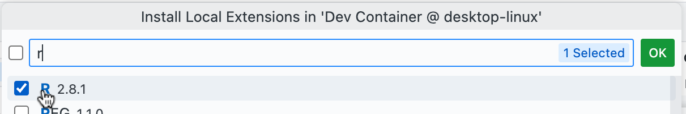

# Test running r-docker in a devcontainer

To use

* Open this repo in VS Code
* When prompted with the following pop-up click *Reopen in Container*
  
* When VS Code reopens using the container, click *cancel* or click *Don't Show Again* on the following pop-up about Git not being found
  
* The first time you open the container you may see this popup in VSCode - perhaps counterintuively click *No* on this as language server features have been setup automatically
  

* To run R commands in the R session running in the VSCode Terminal
  * Your *.R* files should have syntax highlighting and command autocompletion as you type
    
  * You should be able to run R commands line by line (or highlighting a selection) by pressing <kbd>Ctrl</kbd>+<kbd>Enter</kbd> (<kbd>Cmd</kbd>+<kbd>Enter</kbd> on a Mac)
  * Plots should be viewable and pop out in their own window or in a VSCode pane, e.g. a test `plot(1:10)` should popup (when run from Windows) as
    

    on macOS the plots may display in a VSCode tab.
  * Alternatively you can run *.R* scripts in the R session with for example
    ```r
    source("test.R")
    ```

## Notes

* The REditorSupport VSCode extension is installed in the devcontainer; [VSCode extension marketplace entry](https://marketplace.visualstudio.com/items?itemName=REditorSupport.r)
* The relevant devcontainer docs are [here](https://code.visualstudio.com/docs/devcontainers/containers#_create-a-devcontainerjson-file)
* The full list of features of REditorSupport is [here](https://github.com/REditorSupport/vscode-R/wiki/R-Language-Service)

### Users with Apple Silicon Macs

* On M1/M2 Macs the installation of the REditorSupport extension within the devcontainer seems to almost always hang
* To stop the hanging and get the extension installed you need to (procedure derived from [here](https://github.com/microsoft/vscode-remote-release/issues/8169#issuecomment-1543987445))
  * On first building the container press <kbd>Ctrl</kbd>/<kbd>Cmd</kbd>+<kbd>Shift</kbd>+<kbd>P</kbd>, select *Developer: Reload Window*
  * Then go to the Extensions pane - the middle section for the devcontainer - click on the cloud icon and install the R extension in the devcontainer by searching for "r" then pressing *OK*
  

  * The extension should now be installed in the devcontainer and the R language server should work as expected
