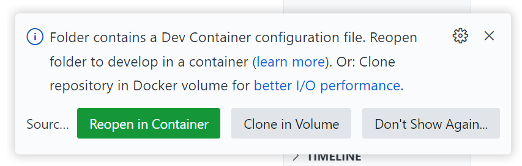
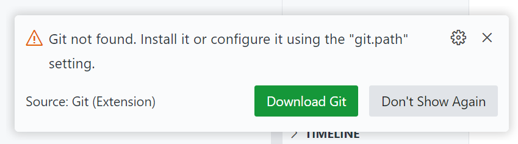
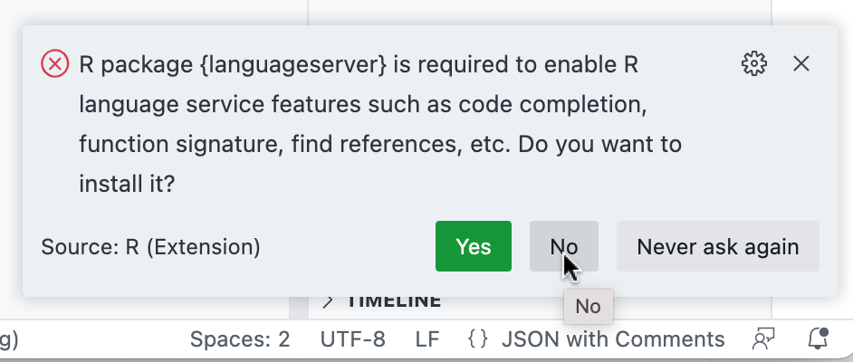
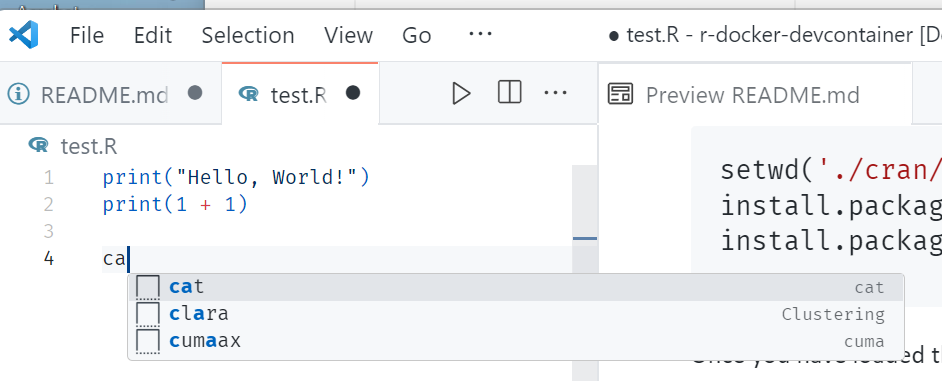
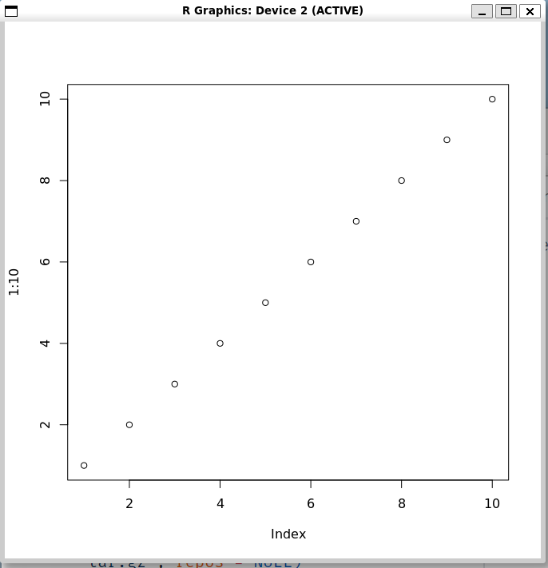

# Test running r-docker in a devcontainer

To use

* Open this repo in VS Code
* When prompted with the following pop-up click "Reopen in Container"
  
* When VS Code reopens using the container, cancel or click "Don't Show Again" on the following pop-up about Git not being found
  
* To setup languageserver features in the devcontainer the first time you open the container you may see this popup in VSCode - perhaps counterintuively click *No* on this (as the next command will sort this out)
  
  In the R session in the Terminal run
  ```r
  source('setup.R')
  ```
* To run R commands in the R session running in the VSCode Terminal because hopefully the *.Rprofile* file, which automatically runs when the R session is starts, should have setup language server features, such as
  * Your *.R* files should have syntax highlighting and command autocompletion as you type
    
  * You should be able to run R commands line by line (or highlighting a selection) by pressing <kbd>Ctrl</kbd>+<kbd>Enter</kbd> (<kbd>Cmd</kbd>+<kbd>Enter</kbd> on a Mac).
  * Plots should be viewable and pop out in their own window, e.g. a test `plot(1:10)` should popup as
    
  * Alternatively you can run *.R* scripts with
    ```r
    source("test.R")
    ```

## Notes 

* In the devcontainer the REditorSupport VSCode extension is added ([VSCode extension marketplace entry](https://marketplace.visualstudio.com/items?itemName=REditorSupport.r)).
* The devcontainer docs for this are [here](https://code.visualstudio.com/docs/devcontainers/containers#_create-a-devcontainerjson-file).
* The full list of features of REditorSupport is [here](https://github.com/REditorSupport/vscode-R/wiki/R-Language-Service).
